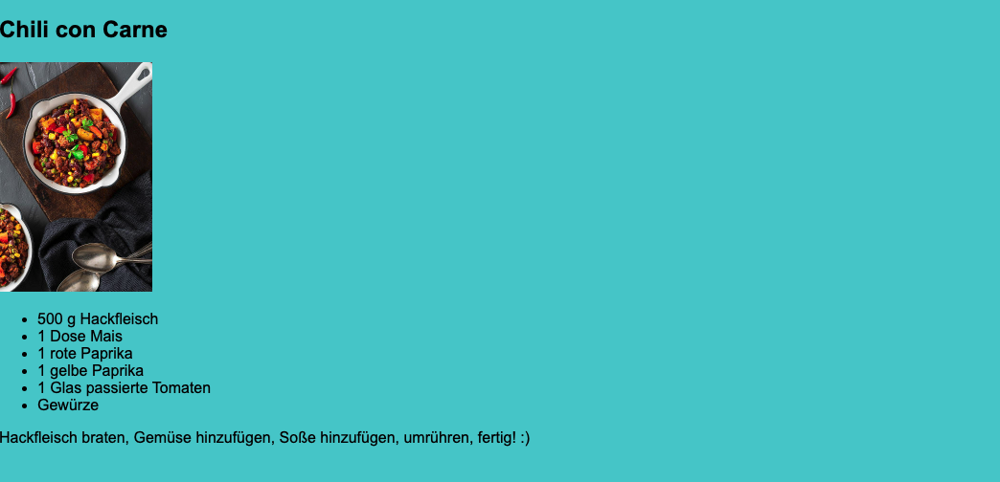
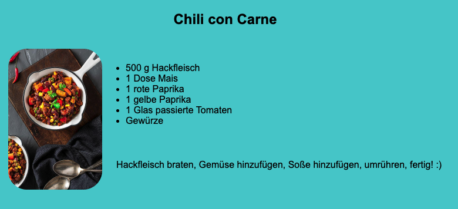

# Learning Repository for CSS Grid

This is a repository to be used to teach the basics for CSS Layout with Grid.

In the following you will learn how to use this repository:

1. First, clone this repository and open it with VSCode.
2. Run the code with a live server. In case you don't have one installed you can install [this live-server](https://www.npmjs.com/package/live-server). To do so:
   - Install it with `npm i live-server`
   - You can run the code with `npx live-server`
   - On the page that opens in the browser, open `recipes.html`

The page that opens looks like this:

Now, you can show your students the code and its output in the browser.
Use CSS grid in `recipes.css` to make the page look something like this:

In case you're not sure how to adjust your CSS, you can find a solution in the branch [solution](https://github.com/lajanzen/learn-css-layout-grid/tree/solution).

Any other solution you see fit, will of course also work.
